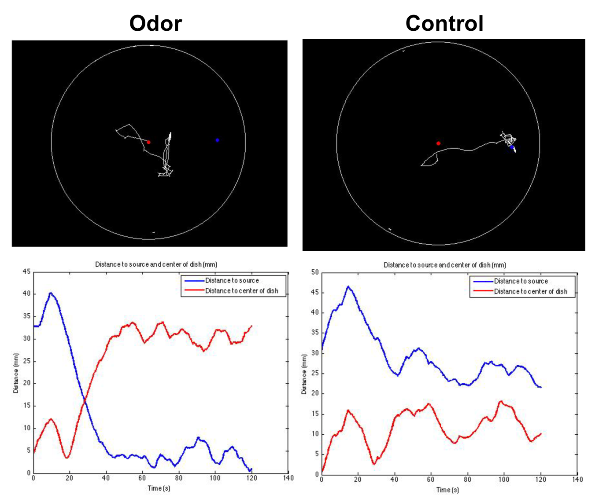

# EZTrack

###### Original script written by Andreas Braun 
###### Modified by Matthieu Louis (mlouis_at_lifesci.ucbs.edu) and Ajinkya Deogade

### Purpose
Basic script aiming at tracking a single larva freely moving in a Petri dish

### Instructions
Run this programm in the folder that contains the image sequence to be analyzed. This routine requires the image analysis package of Matlab.
